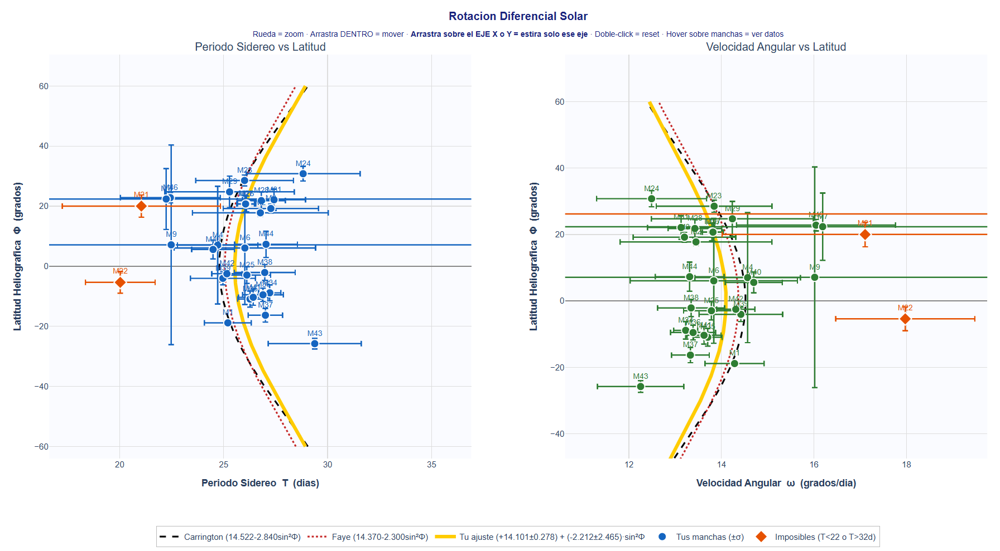

# 🌞 TFG — Estudio de la dinámica de los gases ionizados en la fotosfera solar

Repositorio del Trabajo de Fin de Grado de **Lydia Tomás Sanz** (Grado en Física, UAX).

El trabajo corrobora la **rotación diferencial del Sol** mediante el seguimiento de
manchas solares fotografiadas con un telescopio reflector (Newton) y un teléfono
móvil, comprobando que el ecuador gira más rápido que los polos.

```
tfg-lydia-astronomia/
├── simulador_3d/     Simulador 3D del ángulo µ
├── gestor_web/       Aplicación + base de datos (datos, ajuste, animación, resultado)
├── codigo_calculo/   Código de cálculo (píxel → coordenadas heliográficas, ajuste)
└── figuras/          Generación de figuras (ejes/meridianos y gráfica de Faye)
```

---

## Cómo acceder

**Opción 1 — Aplicación en línea (recomendada).** No requiere instalar nada; se
abre en el navegador:

> **https://tfg-lydia-astronomia-gdan89vjq3jvfdgtdy8bez.streamlit.app/**

En el menú lateral se elige el apartado: **Inicio**, **Gestor de manchas**,
**Simulador 3D**, **Ejes y meridianos** o **Calculadora astronómica**.

**Opción 2 — Ejecutar en local.** Requiere Python 3:

```bash
pip install -r requirements.txt
cd gestor_web
streamlit run Inicio.py
```


### 1. Simulador 3D del ángulo µ — `simulador_3d/`

Esfera celeste interactiva que calcula **µ** en tiempo real según la hora sidérea,
el día del año y la latitud, mostrando π, γ, el arco ⊙–π y el ángulo µ sobre el Sol,
además de calcular otros valores (Bπ y su regla de signo, y el azimut y la altura
del Sol y de π). Funciona en el navegador, sin instalación.


## 2. Aplicación y base de datos — `gestor_web/`

Aplicación principal (Streamlit) para introducir, calcular y visualizar las
manchas. La base de datos con las medidas tomadas por Lydia Tomás Sanz se encuentra en
`gestor_web/manchas_tfg.db`.

En la barra lateral se ofrecen **dos modos**:

- **Ver los datos de Lydia (solo lectura).** Permite explorar las observaciones,
  los resultados, animaciones y las gráficas. Los datos no se pueden modificar.
- **Medir mis propios datos.** Parte de una base de datos vacía con la misma
  estructura, donde el usuario introduce sus propias observaciones y manchas y
  obtiene su ajuste ω(Φ) = A + B·sin²Φ con su gráfica.

El gestor se organiza en pestañas:

| Pestaña | Contenido |
|---|---|
| Observaciones (Fotos) | cada fotografía con su fecha, centro, radio, λ☉ y β |
| Mediciones (Manchas) | cada mancha medida y sus coordenadas heliográficas |
| Resultados Calculados | velocidad ω y periodo de cada mancha, y el ajuste ω(Φ) |
| Animación Solar | animación de la rotación de las manchas, tanto de abril 2026 (video y simulación), como de agosto 2024 (simulación) |
| Errores (±σ) | propagación de incertidumbres |
| Fotos (galería) | fotografías con ejes abril 2026, limpias abril 2026 y las de agosto de 2024 |
| Resultado final | gráfica interactiva (ω y periodo frente a la latitud) y comparación con Carrington y Faye |

La aplicación incluye además tres herramientas interactivas:

- **Ejes y meridianos.** Dibuja el ecuador, los paralelos heliográficos y el eje
  Norte–Sur sobre una foto del Sol (de la base de datos o subida por el usuario introduciendo unos valores)
- **Calculadora astronómica.** Reproduce las conversiones del código principal
  (coordenadas horizontales, ecuatoriales y eclípticas), el cálculo del ángulo µ
  del Sol y la distancia entre dos manchas.
- **Simulador 3D del ángulo µ.** Explciado en 1º apartado.
  

## 3. Código de cálculo — `codigo_calculo/`

- **`calculo_principal.py`** — núcleo del trabajo: transformación píxel →
  coordenadas heliográficas (ángulo µ, corrección óptica β_opt, proyección
  ortográfica inversa y triángulo del polo solar) y ajuste de la rotación
  diferencial. Su «modo i» abre directamente la aplicación.
- **`calculo_coeficientes_AB.py`** — calcula los coeficientes A y B del ajuste de
  la rotación (con todos los datos y sin la toma del 22 por la mañana).
- **`gen_tablas.py`** — genera las tablas en LaTeX a partir de la base de datos.
- **`video_alineado.py`** — prepara el vídeo de las manchas alineadas que se
  muestra en la pestaña «Animación».

## 4. Figuras — `figuras/`

- **`dibujar_ejes_en_fotos.py`** — dibuja los ejes y meridianos heliográficos
  sobre las fotografías del Sol, a partir de los datos de cada observación.
- **`rotacion_solar.html`** — gráfica interactiva de Faye–Carrington: velocidad
  angular ω y periodo frente a la latitud heliográfica Φ.



---

## Resultado principal

Ajustando ω(Φ) = A + B·sin²Φ a las 27 manchas seguidas:

> **A = +14,10 ± 0,28 °/día,  B = −2,21 ± 2,47 °/día**  (χ²_ν ≈ 0,94)

El coeficiente **B < 0** confirma la rotación diferencial, el ecuador gira más
rápido que los polos, lo que descarta el giro rígido. El periodo ecuatorial
resulta de unos **25 días sidéreos**, en buen acuerdo con los valores clásicos de
Carrington y Faye.

---

## Requisitos

La aplicación necesita: `streamlit`, `pandas`, `numpy`, `plotly` (ver
`requirements.txt`). Los scripts de figuras y vídeo requieren además
`opencv-python`, `matplotlib` e `imageio-ffmpeg`.

---
Autora: **Lydia Tomás Sanz** · Trabajo de Fin de Grado, Grado en Física (UAX).
